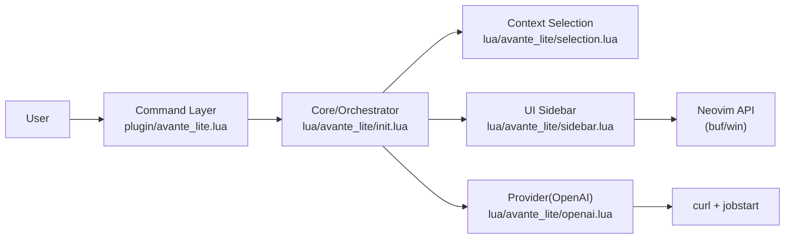
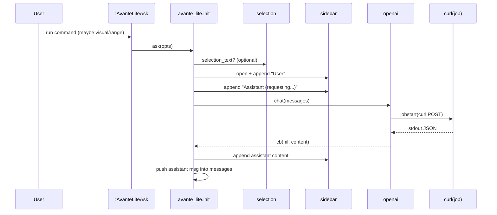

# avante-lite.nvim Architecture

目标：在 Neovim 里实现一个“Avante 风格”的极简 AI 侧边栏插件（先做 Ask），用 **最少模块** 把核心闭环跑通，并为后续 `Edit + diff` 留出清晰扩展点。

> 术语澄清：这里的“侧边栏 UI”本质上是 **一个右/左侧分屏窗口（window）显示一个 scratch buffer**。  
> “结果 buffer”= 存放 AI 输出的 scratch buffer；“侧边栏”= 把它用 `vsplit` 固定显示在侧边。

---

## 1. 范围（MVP）

### ✅ MVP 做什么

- `Ask`：输入问题（或命令行参数）→（可选）带上选区上下文 → 调 OpenAI → 输出到侧边栏 buffer
- 会话：在同一个 sidebar 里按顺序追加（User/Assistant），并维护 `messages` 作为对话上下文
- `Stop`：停止当前请求（通过 `jobstop`）
- `Clear`：清空 UI + 重置会话（保留 system prompt）

### ❌ MVP 暂不做什么（明确推迟）

- `Edit`（改代码）、结构化 patch、diff 预览与应用
- 流式输出（streaming）
- 多 pane 侧边栏（result/input/selected_code/files/todos 等）
- 多文件上下文（repo scan、文件选择、RAG）
- Token 计数、模型选择器、历史记录持久化

---

## 2. 设计原则（战略层面）

1. **单向依赖**：Command → Core → (UI/Selection/OpenAI)；UI/Provider 不反向依赖 Core。
2. **窄接口**：每个模块只暴露最小 API；Core 用接口编排，不直接“伸手”操作底层细节。
3. **可替换基础设施**：OpenAI 的 transport（curl → plenary/http）可替换，不影响 UI/Selection。
4. **扩展点前置**：为未来 Edit/diff 设计边界：`generate` 与 `apply` 分离、预览与确认成为独立阶段。

---

## 3. 分层架构（High-level）



---

## 4. 模块划分（Module Map）

目录（插件内）：

```
local/avante-lite.nvim/
  plugin/avante_lite.lua
  lua/avante_lite/
    init.lua
    config.lua
    sidebar.lua
    selection.lua
    openai.lua
  README.md
  ARCHITECTURE.md
```

### 4.1 `plugin/avante_lite.lua`（Command Layer）

职责：
- 定义用户命令
- 只做参数/范围（range）解析，然后调用 `require("avante_lite").ask(...)`

原则：
- 不写业务逻辑（不拼 prompt、不处理 UI、不调 OpenAI）

暴露命令：
- `:AvanteLiteAsk [question]`（支持 `:'<,'>AvanteLiteAsk` 范围选区）
- `:AvanteLiteAskVisual`（用上次可视选区精确列范围）
- `:AvanteLiteStop`
- `:AvanteLiteClear`

### 4.2 `lua/avante_lite/init.lua`（Core / Orchestrator）

职责：
- 维护全局状态：
  - `cfg`：配置
  - `messages`：会话消息（OpenAI chat 格式）
  - `job_id`：用于 Stop
- Ask 编排：
  1) 收集 question
  2) 可选：抽取 selection_text
  3) 打开侧边栏并渲染 “User/Assistant”
  4) 调 OpenAI
  5) 写回 sidebar 并更新 messages

公开 API（对外）：
- `setup(user_opts?)`
- `ask(opts?)`
- `stop()`
- `clear()`

关键内部函数：
- `build_user_content(question, selection_text)`：将选区包装为 Markdown code fence，作为 context。

### 4.3 `lua/avante_lite/sidebar.lua`（UI）

职责：
- 管理一个 scratch buffer + 一个侧边 split window
- 提供“追加输出/清空/聚焦/返回代码窗口”等基础操作

公开 API：
- `open(cfg)`：打开侧边 split 并显示 buffer（或复用已有）
- `append(lines)`：追加多行文本（由 Core 负责决定渲染内容）
- `clear()`：清空 buffer
- `focus()` / `back_to_code()`
- `is_open()` / `close()`

约束：
- UI 不知道什么是 OpenAI、messages、selection；它只负责显示文本。

### 4.4 `lua/avante_lite/selection.lua`（Context）

职责：
- 从当前 buffer 抽取文本：
  - `from_range(bufnr, line1, line2)`：基于命令范围（行）
  - `from_visual(bufnr)`：基于可视模式标记（列范围）

原则：
- 只返回字符串，不做渲染、不做 prompt 拼接。

### 4.5 `lua/avante_lite/openai.lua`（Provider / Transport）

职责：
- 用 `curl + jobstart` 发起一次 OpenAI Chat Completions 请求
- 在 `on_exit` 解析 JSON，回调 `cb(err, content)`

公开 API：
- `chat(req, cb)` → `job_id?`

说明：
- 当前实现是 **一次性返回（非流式）**；未来 streaming 会扩展为 `on_chunk` 追加到 sidebar。

### 4.6 `lua/avante_lite/config.lua`（Config）

职责：
- 定义默认值 `defaults`
- `merge(user_opts)` 产出最终 `cfg`

---

## 5. Ask 的交互时序（Sequence）



---

## 6. 状态与生命周期（State）

### 6.1 会话 messages

- `messages` 是 OpenAI chat 格式数组：`{ role, content }[]`
- `setup()` 时注入一条 `system` 消息作为 base prompt
- 每次 Ask：
  - 追加一条 `user`
  - 请求成功后追加一条 `assistant`

这意味着：同一个侧边栏 buffer 中的问答顺序 = `messages` 的顺序。

### 6.2 取消请求（Stop）

- `openai.chat()` 返回 `job_id`
- `stop()` 会 `jobstop(job_id)` 并将 `job_id=nil`
- UI 追加 “(stopped)” 提示（不写入 messages）

---

## 7. 错误处理策略

MVP 的目标是“行为可理解”，因此错误直接在侧边栏输出一行：
- 缺少 `curl`：立即报错
- 缺少 `OPENAI_API_KEY`：立即报错
- curl 退出非 0：输出 stderr/退出码
- JSON decode 失败：输出提示（并保留原输出在 debug 可扩展点）
- OpenAI 返回 `error.message`：输出 message

未来扩展：可以把错误打印到 `vim.notify` 并附带 `:messages` 可查日志。

---

## 8. 配置与密钥

- 默认从环境变量读取 API key：`OPENAI_API_KEY`
- OpenAI endpoint/model/timeout 等放在 `cfg.openai` 下
- UI 位置与宽度放在 `cfg.ui` 下

---

## 9. 为 Edit + Diff 预留的设计（Roadmap）

当引入 `Edit` 时，建议把“生成改动”与“应用改动”拆成 3 个明确阶段：

1) **生成结构化变更**：LLM 输出明确的 patch 结构（建议统一为 unified diff 或 JSON patch）
2) **预览与确认**：在 Neovim 内展示 diff（可用内置 diff、或引入 diffview）
3) **安全应用**：应用前校验（buffer 未变化/范围校验/冲突检测），再写回

可新增模块（建议路径）：
- `lua/avante_lite/edit/`：
  - `planner.lua`（把选区/文件上下文组织成编辑任务）
  - `patch.lua`（解析与验证 patch）
  - `preview.lua`（diff 预览 UI）
  - `apply.lua`（应用 patch）

并保持 Core 只做编排：`Edit` 的核心是 `Core -> edit.generate -> edit.preview -> edit.apply`。

---

## 10. 可测试性（建议）

MVP 里最值得单测/快速验证的点：
- `selection.from_visual/from_range`：边界行列与空选区
- `build_user_content`：包装格式与 filetype/filename
- `openai.chat` 的错误分支（可通过注入 fake transport 或模拟 curl 输出）

（当前 repo 未引入测试框架；如果你后续要完善，我们再加最小的 Lua 单测工具链。）

